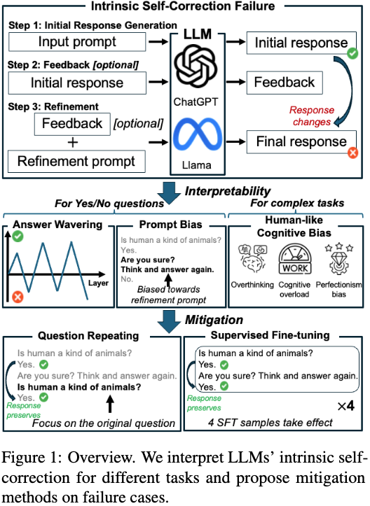
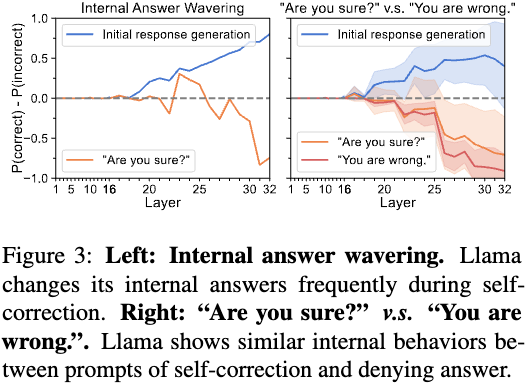
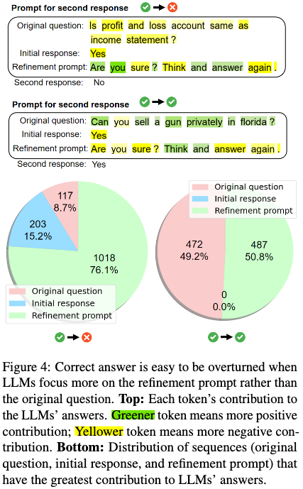

# Understanding the Dark Side of LLMs’ Intrinsic Self-Correction

This is the project repository of our anonymous submission.

## Abstract of our submission
Intrinsic self-correction was proposed to refine LLMs' responses via feedback prompts solely based on their inherent capability to improve their performance However, other recent works show that intrinsic self-correction fails without oracle labels as feedback. In this paper, our goal is to investigate the question of *how to interpret LLMs’ intrinsic self-correction in different tasks?* By including simple factual questions and three complex tasks with state-of-the-art (SOTA) LLMs like ChatGPT families (o1, 4o, 3.5-turbo) and Llama families (2-7B, 3-8B, and 3.1-8B), we achieve our goal by designing three interpretation methods to reveal the dark side of LLMs’ intrinsic self-correction. We identify intrinsic self-correction can (1) cause LLMs to waver both intermedia and final answers and lead to prompt bias on simple factual questions; (2) introduce human-like cognitive bias on complex tasks. In light of our findings, we also provide two simple, low-cost, yet effective mitigation methods: question repeating and supervised fine-tuning.

    

## Internal Answer Wavering

    

In our submission, we design a binary classification probing experiment using tuned lens to probe LLM's internal token representations at each layer. We find that self-correction can cause internal answer wavering. Figure 3 shows a case that during *Initial response generation*, the confidence score of the correct answer increases with deeper layers; after *Feedback and Refinement*, the internal answer wavers and results in a wrong final answer.

 We release the code of probing the internal answer of Llama in `./probing.ipynb`

## Prompt Bias

    

In our submission, we design a method to interpret the prompt bias: Prompt Attribution and Contribution Tracking (PACT). It can measure the contribution of each token or sequence to LLMs' final answers. We find that when the correct answer is overturned, the tokens in the refinement prompt are generally greener than tokens in the original question. This indicates that LLMs are biased toward refinement prompt rather than the original question itself, leading to wrong answers. When the initial correct answer is retained, tokens in the original question are greener. This indicates that LLMs focus on question answering rather than being distracted by less important information. Results are shown in Figure 4.

We release the code of PACT for Llama and ChatGPT in `./PACT.ipynb`

I